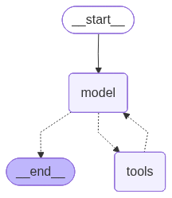

# Substack Newsletter Search Agent

A simple RAG system for searching and chatting with Substack newsletter content.

This project ingests newsletter articles from RSS feeds, stores them in PostgreSQL, indexes embeddings in Qdrant, and serves grounded answers through a FastAPI + LangGraph agent with a Streamlit UI.

Inspired by [benitomartin/substack-newsletters-search-course](https://github.com/benitomartin/substack-newsletters-search-course).

## Table of Contents

- [Overview](#overview)
- [System Architecture](#system-architecture)
- [Agentic Workflow](#agentic-workflow)
- [Project Structure](#project-structure)
- [Quick Start](#quick-start)
- [Production Deployment](#production-deployment)
- [Licence](#licence)

## Overview

Substack Newsletter Search Agent helps you:

- ingest Substack RSS feeds into PostgreSQL
- generate embeddings and index article chunks in Qdrant
- query newsletter content with semantic search
- chat with a LangGraph agent over FastAPI
- use a Streamlit UI for sessions and streaming responses

Core stack:

- Python 3.12+
- FastAPI
- Streamlit
- LangGraph / LangChain
- PostgreSQL / Supabase
- Qdrant
- Prefect
- uv

## System Architecture


The system flow is:

1. RSS feeds are fetched and parsed.
2. Articles are stored in PostgreSQL.
3. Content is chunked, embedded, and indexed in Qdrant.
4. Streamlit sends chat requests to FastAPI.
5. A LangGraph agent uses retrieval and SQL-backed tools to answer with grounded context.
6. Session state and checkpoints are persisted in PostgreSQL.
7. Tracing and observability with LangSmith.

## Agentic Workflow



The current agent is intentionally simple:

- One system prompt
- Qdrant-backed search tools for semantic retrieval
- SQL-backed tools for metadata and time-based queries
- LangGraph state persistence through checkpoints

This keeps the runtime easy to reason about, fast to debug, and good enough for a focused newsletter RAG use case.

## Project Structure

```text
src/
├── api/                    # FastAPI app, routes, models, services
├── infrastructure/         # PostgreSQL and Qdrant integrations
├── models/                 # Domain and SQLAlchemy models
├── pipelines/              # RSS ingestion and embedding flows
└── config.py               # Application settings

frontend/
└── streamlit_app.py        # Streamlit chat UI

static/
├── Substack-newletters-agent.drawio.svg
└── agent-graph.png
```

## Quick Start

### 1. Install dependencies

```bash
uv sync
```

### 2. Create the environment file

```bash
cp .env.example .env
```

At minimum, configure:

- `SUPABASE_DB__*`
- `QDRANT__*`
- one LLM provider key (`OPENROUTER__API_KEY`, `GROQ__API_KEY`, `OPENAI__API_KEY`, or `ANTHROPIC__API_KEY`)
- `BACKEND_URL`
- `ALLOWED_ORIGINS`

### 3. Initialize storage

```bash
make supabase-create
make qdrant-create-collection
make qdrant-create-index
```

### 4. Ingest content

```bash
make ingest-rss-articles-flow
make ingest-embeddings-flow
```

Optional:

```bash
make ingest-embeddings-flow FROM_DATE=2025-01-01
```

### 5. Run the app

```bash
make run-api
make run-streamlit
```

Default local ports:

- FastAPI: `http://localhost:8080`
- Streamlit: `http://localhost:8501`

## Production Deployment

The recommended deployment flow is:

1. Build API and Streamlit images with GitHub Actions.
2. Push SHA-tagged images to GHCR.
3. Pull and recreate services on the VPS with Docker Compose.

Main files:

- `docker-compose.yml`
- `.github/workflows/deploy.yml`

## Licence

This project is licensed under the terms in the [`LICENSE`](LICENSE) file.
